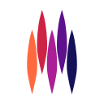
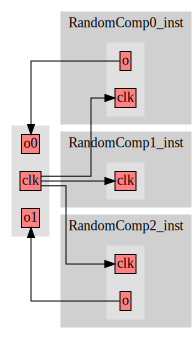

# Cerata
Cerata is a Hardware Construction Library written in C++17. It allows you to describe hardware structures using C++.
The hardware structures are basically graphs (components and instance graphs) with nodes (signals, ports, parameters, 
literals).

Rather than suffering from the verbosity of languages such as VHDL and Verilog, a developer can use Cerata to 
construct potentially complex and nested types, and "drag" them around the design with a few lines of 
code. The hassle of turning the graph representation into something synthesizable for various output targets 
(especially FPGA) is left to Cerata's back-ends.

Furthermore, it allows you to programmatically inspect and modify constructed graphs. This allows other code to 
reflect on designs that were generated, for whatever purpose. Examples include: adding profilers to streams or creating
an optimized infrastructure for bus interfaces required by some components way down in your design hierarchy.

Cerata currently only focuses on structure, not on behavior. This means that Cerata is definitely not a High-Level 
Synthesis tool. Although it might look somewhat similar at a first glance, it is also not an Embedded Hardware 
Construction Language like Chisel, where you can also describe combinatorial and sequential transformations on your 
signals and ports. That project is much more advanced, and you should check it out, if you like Scala and don't mind 
having a relatively large and complicated dependency. Cerata is just a bit lighter-weight but less feature-rich for 
now. And it was interesting to develop.

Currently, there is no front-end language for Cerata, or a storage format for the graphs. We developed Cerata mainly as
a companion library of Fletcher, but it does not include anything specific to Fletcher in its codebase.

## Example:

This simple example generates a component with a bunch of instantiations of two other components.
If you care or think it's relevant, this would be about 150 lines of VHDL.

```C++
// A parameter node.
auto x_width = parameter("width");

// A type using the parameter node as generic.
auto rec = record({field("foo", bit()),
                   field("bar", vector(x_width)),
                   field("parent", stream("child", stream("data", vector(32))))});

// A size parameter for the port array.
auto size = parameter("array_size", 0);

// A component declaration using all of the above.
auto x = component("x", {x_width,
                         size,
                         port_array("a", rec, size, Port::IN)});

// Another parameter for the next component.
auto y_width = parameter("width");
// Another component. The record type is rebound to use the new parameter as generic.
auto y = component("y", {y_width,
                         port("b", (*rec)({y_width}), Port::OUT)});

// The top-level component.
auto top = component("top");
// Instantiate one X component.
auto xi = top->Instantiate(x);

// Instantiate three Y components.
for (int i = 0; i < 3; i++) {
  auto yi = top->Instantiate(y);
  // Append the port array "a" on X, and source it with port "b" of the new Y instance.
  xi->prt_arr("a")->Append() <<= yi->prt("b");
}
```

This example would be easy to write in VHDL too, using the "for ... generate" statement.
However, we can also programmatically inspect the components that we generated in Cerata.

In the following example, we'll generate a few bottom-level components that will randomly
have some output bit. We can just inspect the generated component before we instance it
and connect that bit at the top-level.

```C++
// Generate a bunch of components randomly containing some output.
std::vector<std::shared_ptr<Component>> random_components;
for (int i = 0; i < 3; i++) {
  // Another parameter for the next component.
  auto comp = component("RandomComp" + std::to_string(i), {port("clk", bit(), Port::IN)});
  if (std::rand() % 2 == 1) {
    comp->Add(port("o", bit(), Port::OUT));
  }
  random_components.push_back(comp);
}

// Instantiate the top level.
auto top = component("top", {port("clk", bit(), Port::IN)});
int j = 0;
for (int i = 0; i < 3; i++) {
  // Instantiate every random component.
  auto inst = top->Instantiate(random_components[i]);
  Connect(inst->prt("clk"), top->prt("clk"));
  // Check if it has a port we'd also want to expose at the top-level.
  if (inst->Has("o")) {
    auto top_port = port("o" + std::to_string(j), bit(), Port::OUT);
    top_port <<= inst->Get<Port>("o");
    top->Add(top_port);
    j++;
  }
}
```

This results in the following design:



Of course, components having random output bits might seem weird. But, suppose you're exploring randomized neuron 
configurations in neural networks, or you're building up a design bottom-up based on some external specification
and it may or may not contain a bus interface. In most HDL or even HLS tools that FPGA vendor tools support, it 
would be rather painful to construct such designs. Now you can just use C++ to do it.

For more elaborate examples, check out the tests or check out Fletchgen.
If there is interest for more elaborate documentation, please open an issue.
