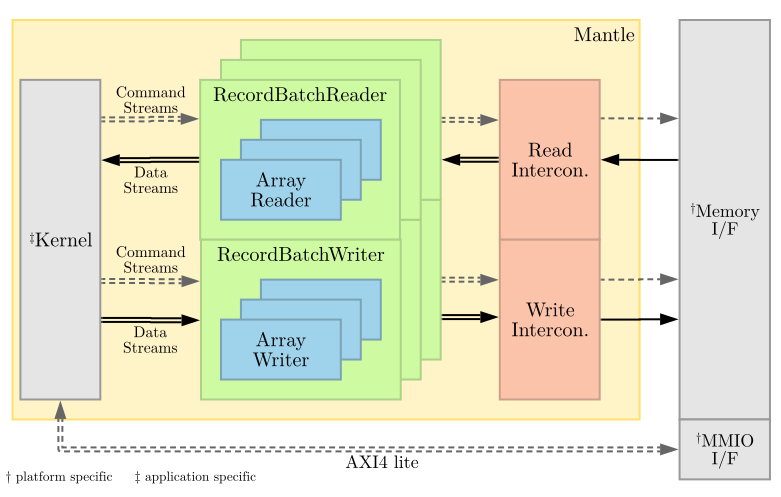

# Fletchgen: The Fletcher Design Generator
Fletchgen is a command-line utility that generates the upper layers of a hardware design, including simulation and 
platform-specific top-levels, based on Arrow Schemas and Recordbatches. 

Currently, the overall structure of a Fletcher hardware design is as follows:

* For each Arrow Field, an ArrayReader/Writer is instantiated.
* For each Arrow Schema, a RecordBatch/Writer is generated and wrapper around all ArrayReader/Writer instances.
* For the combination of all Arrow Schemas, a Kernel is generated.
* All RecordBatch/Writers and the Kernel is wrapped by a Mantle. The Mantle also instantiate the required 
  memory bus interconnection logic.

This can also be shown schematically as follows:


Fletchgen does **not** generate the kernel itself. It currently supports only two top-level platforms. One platform
is a simulation top-level that uses a memory model that can be filled with RecordBatches. The other is a top-level that
has an AXI4 (full) master port and AXI4-lite slave port.

# Prerequisites
* [C++17 compliant compiler](https://clang.llvm.org/)
* [Apache Arrow 0.13+](https://github.com/apache/arrow)
* [CMake 3.14+](https://cmake.org/)

# Build & install
Fletchgen is under heavy development, so for now we'd recommend to make a debug build using CMake as follows: 
```console
git clone https://github.com/abs-tudelft/fletcher.git
cd fletcher/codegen/fletchgen
mkdir debug
cd debug
cmake ..
make
sudo make install
```

# Usage

* Read the command-line options.
```console
fletchgen -h
```

An example how to use Fletchgen [can be found here.](../test/stringread/README.md)

A very gentle tutorial / introduction to Fletcher including how to use Fletchgen and how to generate input files for
Fletchgen [can be found here.](../../examples/sum/README.md)

# Supported/required metadata for Arrow Schemas
Fletchgen derives how to use an Arrow Schema from attached key-value metadata that is stored in Arrow Schemas. 
You can use this to, for example, prevent the generation of hardware structures for fields that you're not going 
to use in your kernel implementation.

## Schema metadata:

| Key                    | Possible values     | Default | Description                                                |
|------------------------|---------------------|---------|------------------------------------------------------------|
| fletcher_name          | any string          | none    | The name of the schema. This is required for the schema to be identifiable after hardware generation.  |
| fletcher_mode          | read / write        | read    | Determines whether a RecordBatch of this schema will be read or written by the kernel. |

## Field metadata:

| Key                    | Possible values | Default | Description                                  |
|------------------------|-----------------|---------|----------------------------------------------|
| fletcher_ignore        | true / false    | false   | If set to true, ignore a specific schema field, preventing generation of hardware to read/write from/to it. |
| fletcher_epc           | 1 / 2 / 4 / ... | 1       | Number of elements per cycle for this field. For `List<X>` fields where X is a fixed-width type, this applies to the `values` stream. |
| fletcher_lepc          | 1 / 2 / 4 / ... | 1       | For `List<>` fields only. Number of elements per cycle on the `length` stream. |

# Further reading

You can generate a simulation top level and provide a Flatbuffer file with a RecordBatch to the simulation environment. 
You can use this to debug your designs in simulation, independent of an FPGA platform specific simulation environment. 
[An example is shown here.](../test/stringread/README.md).
