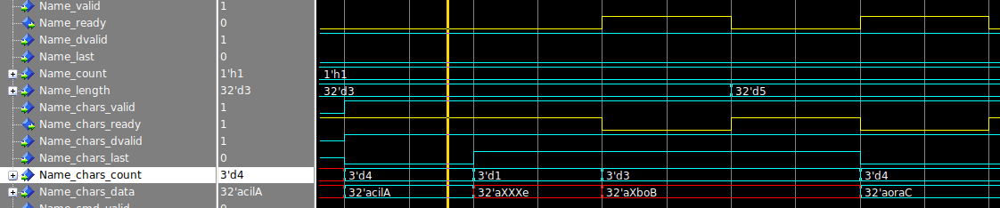

# Hardware simulation of Fletcher designs: Stringread example

This is a simple example of how to use **Fletchgen** to generate a design based on an Arrow Schema.

## Prerequisites

* Build and install [Fletchgen](../../fletchgen/README.md).
* Install some simulator like QuestSim or GHDL.

## Input files

There is one input file for **Fletchgen** in this example.

#### [names.rb](names.rb)

This is an Arrow Recordbatch that contains an Arrow Schema with Fletcher-specific metadata annotated, and some data
(some random people names).

A textual representation of the schema would look as follows:
 
```
Schema metadata (key = value):
  fletcher_name = StringRead
  fletcher_mode = read
             
Field 0:
  Name     : "Name"
  Type     : utf8 
  Metadata : "fletcher_epc" = "4"
```

The schema is very simple, but there are three key-value-pairs of metadata attached at specific places.
* **"fletcher_name"** is attached to the schema itself. This is the name of the schema, that will later on be the name
of a generated RecordBatchReader.
* **"fletcher_mode"** is also attached to the schema itself. Setting this to "read" means that the generated kernel 
is supposed to read from the Arrow RecordBatch (rather than write to it).
* **"fletcher_epc"** is attached to the first field with the name "Name". This will cause the hardware stream generated based on 
  this field to deliver at most four *elements per cycle*. This increases the throughput of our little example kernel.

# Runing fletchgen

We can run now run fletchgen with the "--help" argument to see what sort of options we can supply.
```console
fletchgen --help
```

Let's assume we want to use VHDL as our output language. 
After inspecting the options, we can run fletchgen for this example as follows.

 ```console
fletchgen -r names.rb -s memory.srec -l vhdl --sim
```

This basically means, use the aforementioned input files (the schema and the recordbatch), output the contents for the
memory model as an SREC file at the specified location, use VHDL as an output language and generate a simulation 
top-level.

This will produce the following files:

| File                    | Description                                                                  |
|-------------------------|------------------------------------------------------------------------------|
| vhdl/Kernel.vhdt        | Kernel template                                                              |
| vhdl/StringRead.vhd     | A RecordBatchReader instantiating all ArrayReaders for every Arrow Array (column) of the RecordBatch. |
| vhdl/Nucleus_Kernel.vhd | A wrapper around the Kernel, where some MMIO register and control flow is handled automatically. |
| vhdl/Mantle.vhd         | A wrapper around the Nucleus, RecordBatchReaders and bus interconnect.       |
| vhdl/SimTop_tc.vhd      | Simulation top-level test case                                               |
|-------------------------|------------------------------------------------------------------------------|
| vhdl/mmio_pkg.gen.vhd   | Package generated by vhdmmio containing generic vhdmmio constructs.          |
| vhdl/mmio.gen.vhd       | The mmio component for the control flow of Fletcher, generated by vhdmmio.   |
| vhdl/vhdmmio_pkg.gen.vhd| The package of the mmio component.                                           |
|-------------------------|------------------------------------------------------------------------------|
| stringread.srec         | An SREC file with the contents of the RecordBatch for the memory model in simulation. |

Note that the `vhdl/Kernel.vhdt` file was only generated because there is already an existing `vhdl/Kernel.vhd`. By
default, Fletchgen will not overwrite a file that a user should modify, but *will* only overwrite any existing 
`*.vhdt`-file!

Now, `SimTop_tc.vhd` can be simulated. We will do this using the [vhdeps](https://github.com/abs-tudelft/vhdeps) tool. 
At the time of writing, this tool gives us two simulation targets, either [GHDL](https://github.com/ghdl/ghdl) 
or Questasim/Modelsim.

Suppose we are targeting GHDL, we can invoke vhdeps as follows:

```console
 vhdeps -i path/to/fletcher/hardware -i . ghdl SimTop_tc
```

vhdeps will automatically analyze the dependencies of our simulation top level test case. These files are found in 
the Fletcher hardware directory and the current directory, so we include them using the ```-i``` flag.
We use the ```--no-tempdir``` flag to tell vhdeps to run our test case in the current working directory rather than
a temporary directory it creates by default.
 
Once GHDL has compiled all Fletcher hardware and the files generated by Fletchgen, you should see the simulation Kernel 
outputting the strings that were in the RecordBatch:
 
```
# String 0 : Alice
# String 1 : Bob
# String 2 : Carol
# String 3 : David
# String 4 : Eve
...
```

You can see the waveforms if you run the simulation in gui mode with the ```--gui``` flag. 
In this example, we use QuestaSim as a simulator target for vhdeps.
```console
 vhdeps -i path/to/fletcher/hardware -i . --gui vsim SimTop_tc
```

You can verify that the string lengths and characters of the names appear on the two streams that were generated from
the "Names" field. Add the kernel to the simulation waveforms as follows:

```tcl
add_waves {{"Kernel" sim:/SimTop_tc/Mantle_inst/Kernel_inst/*}}
```

We'll take a look at the StringRead_Name_chars_data signal using ASCII radix, so we can actually read what is going on.
**After you un-collapse the "Kernel" group in the wave window**, you can issue the following TCL command to zoom in on the
waveform and change the radix of this signal.

```tcl
wave zoom range 0 1731ns
property wave -radix ASCII *chars_data 
```

You should see the waveforms as below. Because we have used "fletcher_epc" = "4" as metadata on the "Names" field, you 
can see that the "Name_chars" signal contains 32 bits (four bytes). QuestaSim shows 32'a in front of ASCII strings, so 
the first handshake delivers "cilA" to us, where from the "Name_chars_count" field we can see that all four bytes are 
part of the data. Because the string "Alice" terminates after "e", the next handshake delivers "XXXe" (where X is 
undefined) with a count of 1. That means only the first (rightmost) byte is part of the string. The "Name_chars_last" 
signal is also asserted to signal that this is the last handshake for this string.



