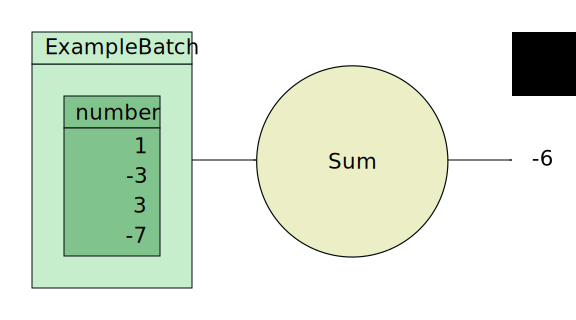

# Getting Started: Simple Column Sum Example

## Prerequisites
Before you start, you need a few libraries and tools to follow this tutorial.
Everything up to step 5 (simulation) can be done with completely free and
open-source tools.

### For hardware generation (step 1 - 3):
The examples in this part of the tutorial are written in Python, so you'll need
* Install [Python 3.6+](https://www.python.org/).
* Install [PyArrow 0.15.1+](https://arrow.apache.org/docs/python/).

Furthermore you'll need to build and install Fletchgen - the Fletcher design
generator tool.
* Build and install [Fletchgen](../../codegen/cpp/fletchgen/README.md).

Also, we make use of vhdmmio - A code generator for AXI4-lite compatible
memory-mapped I/O.
* Install [vhdmmio](https://github.com/abs-tudelft/vhdmmio).

### For simulation (step 5)
* Install a hardware simulator, e.g. [GHDL](https://github.com/ghdl/ghdl)
  or ModelSim/QuestaSim.
* Install [vhdeps](https://github.com/abs-tudelft/vhdeps) - A VHDL dependency
  analyzer.

### For host-side software (step 6)
We will also show how to write a software application, ready to be accelerated
using Fletcher and Arrow, that runs on the CPU. We call this the "host-side"
application, as the CPU "hosts" the accelerator.

For each language, Fletcher provides a run-time library to manage the data and
control flow to and from a Fletcher-based accelerator.

| Language | Run-time library                                           |
|----------|------------------------------------------------------------|
| Python   | Install [pyfletcher](https://pypi.org/project/pyfletcher/) |
| C++      | Build & install [libfletcher](../../runtime/cpp/README.md) |

### For hardware acceleration (step 7)

For actual hardware acceleration, you'll need to access to one of the supported
platforms. We currently support:
* [Amazon EC2 F1](https://github.com/aws/aws-fpga)
* [OpenPOWER CAPI SNAP](https://github.com/open-power/snap)

# Tutorial
The main goal of this tutorial is to learn the basics of working with the
Fletcher framework.

To this end, let's assume we want to create a very simple FPGA accelerator
design that just sums a column of integers in a table, or in Apache Arrow
terminology: sums an array (column) of integers of some recordbatch (tabular
data structure).

Schematically, our desired functionality would look as follows:



We've included some dummy data in our ExampleBatch "table" that we'll also use
throughout this example.

The next few steps will take us through how we can use Fletcher to realize the
functionality shown above.

1. [Generate a Schema](#1-generate-a-schema)
to represent the type of RecordBatch the kernel must operate on.
2. [Generate a RecordBatch](#2-generate-a-recordbatch)
with some dummy data for simulation.
3. [Run Fletchgen](#3-run-fletchgen)
to create a design and kernel template from the Schema and RecordBatch.
4. [Implement the kernel](#4-implement-the-kernel)
using a HDL or HLS.
5. [Simulate the design](#5-simulate-the-design)
to verify its functionality.
6. [Write the host-side software](#6-write-host-side-software)
that integrates with your accelerator through Apache Arrow.
7. [Target a platform](#7-target-a-platform)
to place and route for a real FPGA accelerator implementation.

# 1. Generate a Schema

Fletchgen is the design generator tool of Fletcher. It requires an Arrow
*schema* as input. A schema is nothing more than a description of the type of
data that you can find in an Arrow *recordbatch*. A recordbatch is a tabular
datastructure with columns. These columns are called Arrow *arrays*. Don't
confuse them with C-like arrays! They can be much more complex than that!

When we look at the figure above, we see that our computational kernel (the Sum
kernel) will just take one column from one RecordBatch, and spit out the sum of
all the numbers in the column.

We observe that name of the column with the numbers is `number`. Suppose we'll
choose the numbers to be of Arrow type `int64`. We may now describe an Arrow
*field* of the schema that corresponds to our `number` column.

There is one more thing that Arrow needs to know about the field; whether or not
it's *nullable*, meaning that the number can also be invalid (for example, there
was a corrupted sample in some measurement).  For now, we'll assume that the
numbers are not nullable (i.e. they are always valid).

We will use a little Python script to generate the field.

[Continue the tutorial by checking out this iPython Notebook.](hardware/generate-schema.ipynb)

If you're in a hurry,
[here is the short version, that includes step 2.](hardware/generate-input.py)

# 2. Generate a RecordBatch

Now that we've defined an Arrow schema, we can move to the next step of our
typical design flow. Not only do we want to design the kernel based on the
schema, we'd also like to feed it with some data in a simulation environment,
before throwing our design at the FPGA place and route tools (this can take
multiple hours to complete!).

To this end, we can supply Fletchgen with an actual Arrow recordbatch. In real
applications, these can be very large; in the order of gigabytes. For simulation
we're just going to fill our only recordbatch column with four numbers as is
shown in the figure at the top of this page.

We'll also use a little Python script to generate the recordbatch.

[Continue the tutorial by checking out this iPython Notebook.](hardware/generate-recordbatch.ipynb)

If you're in a hurry,
[here is the short version, that includes step 1.](hardware/generate-input.py)

# 3. Run Fletchgen

Now that we've generated a recordbatch with some test data, it's time to let
Fletchgen do its job. We want Fletchgen to do the following things for us:

1. Create a kernel template based on the schema.
2. Create a design infrastructure based on the schema.
3. Create a simulation top-level with pre-loaded memory model contents based on
   the recordbatch.

We can call Fletchgen from the command line as follow:

```console
$ cd hardware
$ fletchgen -n Sum -r recordbatch.rb -s recordbatch.srec -l vhdl --sim
```

We've used the following options:
* `-n` specifies the name of our kernel.
* `-r` specifies that we want to give Fletchgen a recordbatch.
* `-s` specifies the path of the memory model contents (an SREC file)
* `-l` specifies the output language for the design files, in our case VHDL
  (luckily we don't have to write any!).
* `--sim` specifies that we'd like to generate a simulation top-level.

Now, Fletchgen will generate all the things we've listed above. The output files
in the `hardware/` folder are as follows:

* `memory.srec`: our memory model contents.
* `vhdl/Sum.gen.vhd`: a template for the Sum kernel. Note that there is already
   a `Sum.vhd` file in that folder that has our kernel implemented for us
   already. That means when we start simulating, we just delete the generated
   `Sum.gen.vhd`.
* `vhdl/ExampleBatch.gen.vhd`: a generated "RecordBatchReader".
* `vhdl/Mantle.gen.vhd`: a generated top-level wrapper instantiating the
  "RecordBatchReader" and the "Sum" kernel.
* `vhdl/SimTop_tc.gen.vhd`: the simulation top-level, instantiating the memory
  models and the "Mantle".

As you can see, every generated file will have the `.gen.vhd` extension, so it
will be easy to remove or clean the project.

Internally, Fletchgen will also run **vhdmmio**. Vhdmmio is a tool that
generates code for AXI4-lite compatible memory-mapped I/O (MMIO) register files
and bus infrastructure. We use this tool to simplify the control flow for you.
For example, setting Arrow buffer addresses in the generated interface is
automated this way. Vhdmmio will also output some files, including:

* `vhdmmio-doc/`: folder containing documentation.
* `fletchgen.mmio.yaml`: A YAML file created by Fletchgen and used by vhdmmio
  as input.
* `vhdl/vhdmmio_pkg.gen.vhd`: Global vhdmmio related type definitions package.
* `vhdl/mmio_pkg.gen.vhd`: Generated custom mmio component package.
* `vhdl/mmio.gen.vhd`: Generated custom mmio component implementation.

# 4. Implement the kernel

You can choose any tool or flow you'd like to implement your kernel, as long as
you adhere to the interface defined by the template.

Take a look at the [`Sum.vhd`](hardware/vhdl/Sum.vhd) file from the subfolder of
this readme to see how we've implemented this kernel in HDL.

The kernel implementation includes:
* A state machine to:
  * Generate a command for the generated interface.
  * Absorb data from the data streams and sum the values.

You can read more about how to use the generated interface in the
[hardware guide](../../hardware/README.md).

We'll follow up with an HLS example soon!

# 5. Simulate the design

Now, `SimTop_tc.gen.vhd` can be simulated. We will do this using the
[vhdeps](https://github.com/abs-tudelft/vhdeps) tool. At the time of writing,
this tool gives us two simulation targets, either
[GHDL](https://github.com/ghdl/ghdl) or Questasim/Modelsim.

Suppose we are targeting GHDL, we can invoke `vhdeps` as follows (in the
`hardware` subdirectory).

```console
 vhdeps -i path/to/fletcher/hardware -i . ghdl SimTop_tc
```

`vhdeps` will automatically analyze the dependencies of our simulation top level
test case. These files are found in the Fletcher hardware directory and the
current directory, so we include them using the ```-i``` flag.

Once GHDL has compiled all Fletcher core hardware components and the files
generated by Fletchgen, you should see the simulation top-level returning some
values in the return register.
```
Return register 0: 0xFFFFFFFA
Return register 1: 0xFFFFFFFF
```
In the implementation of our kernel (`Sum.vhd`), we return the summed value on
return register 0. You can see that it returned `0xFFFFFFFA`, which is -6 in
two's complement hexadecimal format. It seems our kernel works properly
according to our test case!

To summarize what we've done so far:
* We've defined an Arrow Schema.
* We've filled an Arrow RecordBatch with some test data.
* Fletchgen has generate a hardware design that supports reading from
  RecordBatches according to the schema.
* Fletchgen has generated a kernel template for us to implement.
* Fletchgen has generated a simulation top-level to test our kernel.
* We've implemented the kernel (not in this tutorial).
* We've run the example using the free and open-source tools `vhdeps` and
  `GHDL`.

If you'd like to run the simulation with a waveform GUI, you could use ModelSim
or QuestaSim through ```vhdeps``` as follows:

```console
 vhdeps --no-tempdir -i path/to/fletcher/hardware -i . --gui vsim SimTop_tc
```

We just added the `--gui` flag and changed the simulator target to `vsim`.

In the Modelsim/Questasim GUI, we can add the waveforms for our kernel and zoom
in on our waveforms by issuing the following command on the TCL terminal:

```tcl
add_waves {{"Kernel" sim:/SimTop_tc/Mantle_inst/Sum_inst/*}}
wave zoom range 0 1700ns
```

Expand the "Kernel" group in the wave window to see the waveforms! Take a look
at the `ExampleBatch_number` stream, and verify that the numbers from our little
Arrow RecordBatch have actually appeared on the stream to our `Sum` kernel.

# 6. Write host-side software

You can check out the [C++](software/cpp) or [Python](software/python) version
of the host side software.

# 7. Target a platform

(coming soon)
