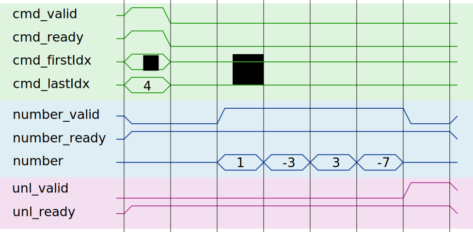

# Hardware Guide

### Table of Contents
1. [Introduction](#introduction)
2. [Schema-derived hardware streams](#schema-derived-hardware-streams)
3. [Handshaking protocol](#handshaking-protocol)
4. [Command stream](#command-stream)
5. [Unlock stream](#unlock-stream)
6. [Arrow data streams](#arrow-data-streams)

## Introduction
If you are just getting started with Fletcher, you will use
[Fletchgen](../codegen/cpp/fletchgen/README.md) to automatically generate a
design. Somewhere, beneath several layers of magically generated hierarchies and
structures, your kernel will reside. The kernel will be the only thing a
hardware developer should have to implement. In terms of interfacing with Arrow
data sets, your kernel will have a bunch of hardware streams. These hardware
streams are derived from the Arrow schemas that you've provided to Fletchgen. In
this guide, it will be explained what these hardware streams are. The signals of
these streams will appear to you when you open up the kernel template that was
generated by Fletchgen.

### Schema-derived hardware streams

**For each Arrow Array** (an Arrow Array is like a column in a tabular in-memory
*data set called an Arrow RecordBatch) that you want to read from, Fletchgen
*will provide you with at least three streams:

1. **Command** stream.
2. **Unlock** stream.
3. **Arrow data stream(s)**. The number of Arrow data streams will depend on the
   type of the Arrow field in your schema.

Operating the interface will generally consist of the following steps:
1. You give a command to the interface over the command stream.
2. The data stream will give you data, or you give data to the interface over
   the data stream.
3. The unlock stream will signal you that all the data was transferred from/to
the memory.

Very much simplified, with several fields omitted, this will look as follows for
the "Hello, world!" example project [that you can find here](../examples/sum):

### Handshaking protocol

All Fletcher hardware streams follow a ready-valid handshaking protocol similar
to AXI4. You can ready about that protocol
[here](https://static.docs.arm.com/ihi0051/a/IHI0051A_amba4_axi4_stream_v1_0_protocol_spec.pdf).
If you fail to adhere to this protocol, you **will** end up with erroneous
designs. If you have never worked with a valid-ready handshaked streaming
protocol before, it is highly recommended to read and **fully understand** the
specification linked above.

Its handshaking characteristics are as follows:
* If and only if `valid` and `ready` are asserted in the same clock cycle, a
  transfer (handshake) is made.
* A producer of stream data may not wait for the `ready` signal to be asserted,
  before asserting `valid`.
* A consumer of stream data may assert `ready` before `valid` is asserted.
* Once `valid` is asserted, it must remain asserted until handshaked and the
  data may not change during this period.

We will now go over each of the aforementioned streams and their function.

### Command stream
This is an output stream for your kernel.

The command stream (or `cmd` stream) is used to issue commands to the generated
interface. This command contains a range of row indices that you would like to
read from an Arrow Array.

It has the following fields:

| Field      | Description |
|------------|-------------|
| `tag`      | An identifier for your command (optional). |
| `firstIdx` | the first row index you want to read. |
| `lastIdx`  | the last row index you want to read, plus one. |

This means that in the range `firstIdx ... lastIdx`, the last index is
exclusive.

If you are sending a command to a RecordBatchWriter (i.e. you are writing stuff
into Arrow format in memory through the generated interface) and you don't know
how large your output is going to be, you can set lastIdx to zero.

### Unlock stream
This is an input stream for your kernel.

The unlock stream will transfer a single handshake for each command that was
handshaked on the command stream. For commands to RecordBatchWriters (i.e. when
you are writing data into the memory in the Arrow format through the generated
interface) that means that all write buffers are emptied and the data should be
in the memory. This stream has the following fields:

| Field      | Description |
|------------|-------------|
| `tag`      | The identifier of the handled command (optional). |

### Arrow data streams
This is either an input stream or an output stream for your kernel, depending on
the `fletcher_mode` metadata value of your schema (see
[Fletchgen](../codegen/cpp/fletchgen/README.md)). This simply depends on whether
you are reading from or writing to an Arrow RecordBatch in memory.

The number of data streams depends on the Arrow type of the field that
corresponds to the Arrow Array this stream was generated for.

#### Primitive types
Primitive (fixed-width) types (such as int32, float64, etc...) will generate a
single stream. This stream will have the following fields:

| Field    | Description                                                                                             |
|----------|---------------------------------------------------------------------------------------------------------|
| `dvalid` | Signals whether this stream transfer contains any data (dvalid is high) or just control (dvalid is low) |
| `last`   | Signals that this is the last transfer of the command.                                                  |
| `count`  | The number of valid Arrow data elements in this transfer (depends on EPC). |
| `data`   | `count` Arrow data elements. |

By default, the number of Arrow data elements transfered (e.g. your int32's or
float64's) is one per cycle. However, you can use the key-value metadata
`{"fletcher_epc", "<epc>"}` on your Arrow field in your Arrow schema to transfer
more **elements-per-cycle** (EPC). This is useful if you want to increase
throughput.

#### Nested types
Some Arrow types are nested, such as `utf8` strings and `binary` or any other
`list<T>` (list of some other type), and `struct`.

In the case of Arrow `struct`, there is no parent stream. In terms of streams
appearing on the interface, the `struct` child fields are just handled as if
it's a separate Arrow Array.

In the case of Arrow `list`, where a RecordBatch element contains a
variable-length piece of data, a parent stream transfers the *length* of the
variable-length piece of data on a "parent" stream (also called the `length`
stream). The "child" stream of this list will transfer the list elements.

##### Nested type streams example:
For example, if we use the `binary` type (which is basically a list of
non-nullable bytes, or sometimes called a blob database land), this is the same
as a `list<byte>`, and we get the following streams and fields:

###### Parent stream:

| Field    | Description |
|----------|-------------|
| `dvalid` | Signals whether this stream transfer contains any data (dvalid is high) or just control (dvalid is low) |
| `last`   | Signals that this is the last list length of the command. |
| `count`  | Not used, is always 1. |
| `length` | The length of the number of elements in the child stream. |

###### Child stream:

| Field    | Description |
|----------|-------------|
| `dvalid` | Signals whether this stream transfer contains any data (dvalid is high) or just control (dvalid is low). It may be, for example, that dvalid is low because we're transfering an empty list. In that case, last is asserted and count and bytes are don't cares. |
| `last`   | Signals that this transfer contains the last elements in the list. |
| `count`  | The number of valid Arrow data elements in this transfer, depends on EPC. |
| `bytes`  | `count` Arrow list elements (in this example: bytes). |

## In-depth Hardware Guide
**(for advanced users only)**
**(partially outdated)**

The basic hardware primitives that Fletchgen instantiates in a large design are
ArrayReader or a ArrayWriter, depending on whether you want to read or write
data from/to an Arrow Array in a RecordBatch. If you want to use these
components directly, e.g. you're not using Fletchgen, then you can read the rest
of this guide below.

For reading, because elements in an Arrow Recordbatch can be processed in
parallel, you are free to implement, for example:

- One ArrayReader for each Arrow Array
- Multiple ArrayReaders for each Arrow Array
- One ArrayReader for just one of the Arrays in a Table
- Multiple ArrayReaders for each Arrow Array

For writing, this depends on the data type. For primitive fixed-width types, it
is possible to have multiple ArrayWriters for a single array. However, for
variable length types (for example; strings), this is currently not possible.
Of course you are free to build up the data set in parallel and merge them later
on your host system in software or in some other way.

To configure a ArrayReader/ArrayWriter, you must set the generics to the HDL
component appropriately. Things like bus data width, bus address width,
burst length, etc... should speak for itself. However, one important
generic is the configuration string.

## ArrayReader/Writer configuration string

The configuration string provided to a ArrayReader/Writer is somewhat
equivalent to an Arrow Schema. It conveys the same information about the
layout/structure of the Array in memory. There are some additional
options to tweak internals (like FIFO depths), but we will ignore them
for now.

[ArrayConfig_pkg.vhd](arrays/ArrayConfig_pkg.vhd) contains an in-depth guide
on which entries of the config string are supported.

**Make sure not to use any whitespace characters in the configuration
such as spaces or newlines.**

The following elements are supported:

- prim(\<width\>)
  - Any type of fixed-width <width\>, such as ints, floats,
  doubles, bits, etc...
- list(\<A\>)
  - A list of any of the supported types
- struct(\<A\>,\<B\>)
  - A structure of any of the supported types
- listprim(\<width\>;epc=N)
  - A non-nullable list of non-nullable
    primitives, where you will receive N of these primitive elements per
    cycle at the output. epc is optional. (useful for UTF8 strings,
    for example).
- null(\<A\>)
  - To allow an element to be nullable

For example, if you have the Schema of a RecordBatch as follows:
<pre>
  Schema {
    X: int32
    Y: string   // Using UTF8 characters
    Z: struct{
      A: int32  // Nullable
      B: double
    }
  }
</pre>
For simplicity, assume all elements are non-nullable, except those of field A
in the struct of field Z.

Suppose we would like to read from this RecordBatch in host memory. You can
instantiate three ArrayReaders using the following three configuration
strings:

- X: "prim(32)"
- Y: "listprim(8)"
- Z" "struct(null(prim(32)),prim(64))"

## ArrayReader/Writer interface

After you set the ArrayReader/Writer configuration string, the hardware
structure is generated.

Each ArrayReader/Writer has the following streams:

* From accelerator to ArrayReader/Writer:
  * Command (cmd): To issue commands to the ArrayReader/Writer

* From ArrayReader/Writer to accelerator:
  * Unlock:  To notify the accelerator the command has been executed.

A ArrayReader additionally has the following streams:

* From ArrayReader to host memory interface:
  * Bus read request (bus_rreq): To issue burst read requests to the host
    memory.
* From host memory interface to ArrayReader:
  * Bus read data (bus_rdat): To receive requested data from host memory.
* From ArrayReader to accelerator:
* Data (out):
  * Streams of the data type defined in the schema.

For ArrayWriters:

* From ArrayReader to host memory interface:
  * Bus write request (bus_wreq): To issue burst write requests to the host
    memory.
  * Bus write data (bus_wdat): To stream write data to host memory.
* From accelerator to ArrayWriter
* Data (in):
  * Streams of the data type defined in the schema.

The streams follow the ready/valid handshaking methodology similar to AXI4.
This means a transaction is handshaked only when both the ready and valid
signal are asserted in a single clock cycle. Furthermore, it means any producer
of a stream may not wait for the ready signal to be asserted. However, a stream
consumer may assert ready before any valid signal is asserted. For more detail,
it is __highly recommended to read the AXI4 protocol specification chapter on
"Basic read and write transactions"__.

## Configuration string examples:
Here are some examples that show the lay-out of the output (out) or input (in)
streams for specific schema's.

In these examples, whenever the (nested) field is nullable, the config string
should be wrapped with null().

### Int32 Array
#### Config string
`prim(32)`
or
`null(prim(32))`
if it is nullable.
#### User signals
##### Stream 0
* data(32): (optional) '1' when this element is not null, '0' otherwise
* data(31 ... 0): Int32 element
* last: '1' when element is last in request, '0' otherwise

### List\<Char\>
#### Config string
`list(prim(8))`
or
`null(list(null(prim(8))))`
if both the list and the char are nullable.
or
`null(list(prim(8)))`
if only the list is nullable
or
`list(null(prim(8)))`
if only the char is nullable.

Assuming the null() examples are clear, we omit them in further examples.

#### User signals
##### Stream 0
* data(32): (optional) '1' when this list is not null, '0' otherwise
* data(31 ... 0): length of list of chars
* last: '1' when list is last in request, '0' otherwise
##### Stream 1
* data(8): (optional) '1' when this element is not null, '0' otherwise
* data(7 ... 0): Char element
* last: '1' when element is last in request, '0' otherwise

### List\<List\<Byte\>\>
#### Config string
`list(list(prim(8))`
#### User signals
##### Stream 0
* data(32): (optional) '1' when this list (of lists of lists) is not null, '0'
  otherwise
* data(31 ... 0): length of list (of lists of lists)
* last: '1' when list (of lists) is last in request, '0' otherwise
##### Stream 1
* data(32): (optional) '1' when this list (of lists) is not null, '0' otherwise
* data(31 ... 0): length of list (of bytes)
* last: '1' when list (of lists) is last in request, '0' otherwise
##### Stream 2
* data(8): (optional) '1' when this element is not null, '0' otherwise
* data(7 ... 0): Byte element
* last: '1' when element is last in request, '0' otherwise

### Struct\<List\<Char\>, Int32\>
#### Config string
`struct(list(prim(8)),prim(32))`
#### User signals
##### Stream 0
**Note well: when any of the "not null" bits are unused, the bit indices shift
accordingly.**
* data(66): (optional) '1' when the whole struct is not null, '0' otherwise
* data(65): (optional) '1' when the list field in the struct is not null, '0'
  otherwise
* data(64 ... 33): length of list (of chars)
* data(32): (optional) '1' when the int32 field in the struct is not null, '0'
  otherwise
* data(31 ...  0): Int32 element
* last: '1' when struct is last in request, '0' otherwise
##### Stream 1
* data(8): (optional) '1' when this element is not null, '0' otherwise
* data(7 ... 0): Char element
* last: '1' when element is last in list, '0' otherwise

### List\<Struct\<List\<Char\>, Int32\>>
#### Config string
`list(struct(list(prim(8)),prim(32)))`
#### User signals
#### Stream 0
* data(32): (optional) '1' when this list (of structs) is not null, '0'
  otherwise
* data(31 ... 0): length of list (of structs)
* last: '1' when list (of structs) is last in request, '0' otherwise
#### Stream 1
**Note well: when any of the "not null" bits are unused, the bit indices shift
*accordingly.**
* data(66): (optional) '1' when this struct is not null, '0' otherwise
* data(65): (optional) '1' when the list field in the struct is not null,
  '0' otherwise
* data(64 ... 33): length of list (of chars)
* data(32): (optional) '1' when the int32 field in the struct is not null,
  '0' otherwise
* data(31 ...  0): Int32 element
* last: '1' when struct is last in list (of structs), '0' otherwise
#### Stream 2
* data(8): (optional) '1' when this element is not null, '0' otherwise
* data(7 ... 0): Char element
* last: '1' when element is last in list, '0' otherwise

# More information

For more in-depth information, check out
[ArrayConfig.vhd](arrays/ArrayConfig_pkg.vhd)
