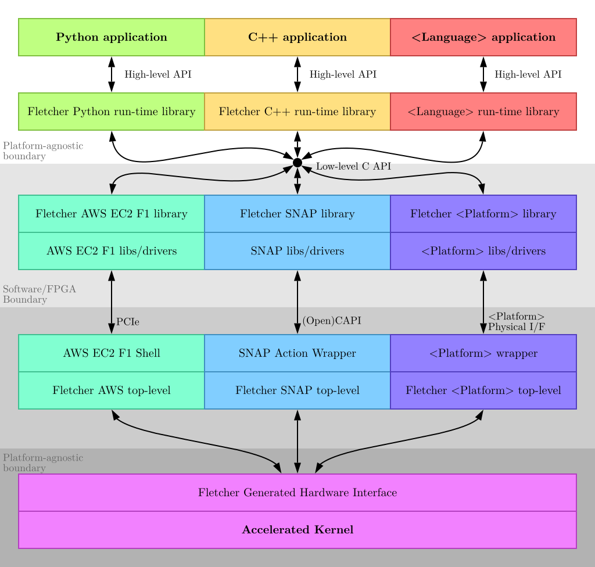

# Fletcher platform-specific libraries

## Supported platforms
Currently, three FPGA platforms are supported by Fletcher. 
Please refer to their respective repositories:
* [AWS EC2 f1](https://github.com/abs-tudelft/fletcher-aws)
* [CAPI SNAP](https://github.com/abs-tudelft/fletcher-snap)
* [Xilinx Alveo](https://github.com/abs-tudelft/fletcher-alveo) (Under Development)

They are maintained in separate repositories. We do this because currently, setting up integration tests for these 
platforms in our Continuous Integration pipeline is hard, for at least three reasons:
* The platforms use proprietary tools.
* It would take at least many hours, if not days, to synthesize, place, route and test multiple designs for real 
FPGA hardware.
* The platforms could be accessed publicly through cloud services, but spawning FPGA instances incurs significant 
costs.

Therefore, these platform-specific repositories are tested manually against a specific tag of our development branch. 
Our goal is to at least test them every time we make a Fletcher release tag.

### Echo platform
A third platform exists, named [Echo](echo), that can be used for debugging purposes or as a reference to implement new 
platform libraries. This implementation simply prints out any commands that a language run-time library requests on 
the standard output. Echo does not use any proprietary tools and does not require any actual FPGA hardware to function.
It is therefore maintained within this repository and even used within the CI pipelines.

## Software / hardware stack

Fletcher is designed to be as platform-agnostic as possible. To this end, it communicates with real FPGA platforms 
through a platform-specific run-time library that is linked into the Fletcher run-time library during run-time. These
platform-specific libraries expose a low-level API to the more abstract and platform-agnostic Fletcher run-time 
libraries that developers should use to write host-side software.

An overview of the Fletcher stack is seen below:

